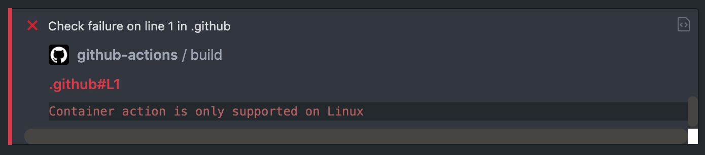

<div align="center">
    <h1>AWS S3 Javascript action</h1>
</div>

GitHub Action that uploads a directory from your repository to an S3 bucket, using the
[AWS SDK for JavaScript](https://aws.amazon.com/sdk-for-node-js/). It optionally triggers a CloudFront invalidation
afterwards.

It is the JavaScript equivalent of [aws-s3-docker-action](https://github.com/raulanatol/aws-s3-docker-action), for the
cases where a container action is not an option:

`Container action is only supported on Linux`



Runs on the `node20` action runtime.

---

# Credentials

Credentials are **not** read from the action inputs. They are resolved by the AWS SDK from the standard environment
variables, so they must be provided under `env:`:

| Variable                | Description               |
|-------------------------|---------------------------|
| `AWS_ACCESS_KEY_ID`     | The AWS access key id     |
| `AWS_SECRET_ACCESS_KEY` | The AWS secret access key |

The `AWS_ACCESS_KEY_ID` / `AWS_SECRET_ACCESS_KEY` **inputs** are kept only for backwards compatibility and are ignored.

# Inputs

| Key                                | Description                                                                                                     | Required | Default     |
|------------------------------------|-----------------------------------------------------------------------------------------------------------------|----------|-------------|
| `AWS_REGION`                       | The region of the bucket                                                                                        | **TRUE** | `us-west-2` |
| `AWS_BUCKET_NAME`                  | The bucket to sync                                                                                              | **TRUE** |             |
| `SOURCE`                           | Local directory to upload to S3                                                                                 | **TRUE** |             |
| `TARGET`                           | Key prefix of the destination in S3                                                                             | **TRUE** |             |
| `WITH_DELETE`                      | `TRUE` to empty the `TARGET` prefix before uploading, like the [*--delete* flag](https://docs.aws.amazon.com/cli/latest/reference/s3/sync.html#synopsis) |          | `FALSE`     |
| `WITH_CLOUDFRONT_INVALIDATION`     | `TRUE` to invalidate CloudFront after the upload                                                                |          | `FALSE`     |
| `AWS_CLOUDFRONT_DISTRIBUTION_ID`   | The CloudFront distribution id (required when invalidation is enabled)                                          |          |             |
| `AWS_CLOUDFRONT_INVALIDATION_PATH` | Path of the CloudFront invalidation (required when invalidation is enabled)                                     |          |             |

Boolean inputs are compared case-insensitively against `TRUE`; anything else is treated as false.

`WITH_CLOUD_FRONT_INVALIDATION` is accepted as a deprecated alias of `WITH_CLOUDFRONT_INVALIDATION`.

# Example usage

Create the file `workflow.yml` in the `.github/workflows` folder.

```yaml
name: S3 Sync
on: [push]
jobs:
  deploy:
    runs-on: ubuntu-latest
    steps:
      - uses: actions/checkout@v4

      - name: Sync to S3
        uses: raulanatol/aws-s3-js-action@v1
        with:
          AWS_REGION: eu-west-1
          AWS_BUCKET_NAME: ${{ secrets.AWS_BUCKET_NAME }}
          SOURCE: ./build
          TARGET: /
          WITH_DELETE: 'TRUE'
          WITH_CLOUDFRONT_INVALIDATION: 'TRUE'
          AWS_CLOUDFRONT_DISTRIBUTION_ID: ${{ secrets.AWS_CLOUDFRONT_DISTRIBUTION_ID }}
          AWS_CLOUDFRONT_INVALIDATION_PATH: /*
        env:
          AWS_ACCESS_KEY_ID: ${{ secrets.AWS_ACCESS_KEY_ID }}
          AWS_SECRET_ACCESS_KEY: ${{ secrets.AWS_SECRET_ACCESS_KEY }}
```

# Development

Requires Node.js as declared in [`.nvmrc`](.nvmrc).

```bash
make init   # install dependencies
make test   # run the test suite
make        # lint, type-check, test and build
```

`dist/` holds the bundled action and **is committed to the repository**: run `make` and commit the result whenever
`src/` changes, otherwise the published action keeps running the previous code.

Releases are cut from `main` with `make release_patch`, `make release_minor` or `make release_major`, which tag the
repository and let the [release workflow](.github/workflows/release.yml) publish it.

# License

[MIT](LICENSE)
